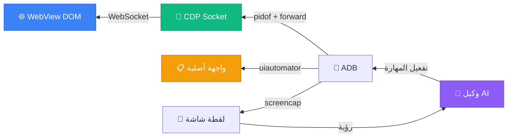

<p align="center">
  
</p>

<h1 align="center" dir="rtl">مهارة اختبار WebView للأجهزة المحمولة</h1>

<p align="center" dir="rtl">
  <strong>اجعل أي وكيل ذكاء اصطناعي يختبر تطبيقك على هاتف Android حقيقي</strong><br>
  <sub>Chrome DevTools Protocol + ADB. بدون Appium. بدون Selenium. بدون خادم Java.</sub>
</p>

<p align="center">
  <a href="LICENSE"></a>&nbsp;
  <a href="https://agentskills.io/specification"></a>&nbsp;
  <a href="#التوافق"></a>&nbsp;
  <a href="https://github.com/wimi321/mobile-webview-testing/stargazers"></a>
</p>

<p align="center">
  <a href="README.md">English</a> · <a href="README.zh-CN.md">简体中文</a> · <a href="README.ja.md">日本語</a> · <a href="README.ko.md">한국어</a> · <a href="README.es.md">Español</a> · <strong>العربية</strong>
</p>

---

> [!TIP]
> **التثبيت في 10 ثوانٍ** — يعمل مع Claude Code وCodex وGemini CLI وCopilot وCursor والمزيد:
> ```
> npx skills add wimi321/mobile-webview-testing
> ```

<br>

<div dir="rtl">

## لماذا هذه المهارة موجودة

بنيت تطبيقًا بـ Capacitor أو Ionic. يعمل بشكل مثالي في المتصفح. الآن تحتاج لاختباره على هاتف حقيقي.

هذا ما ستكتشفه:

| الأداة | المشكلة |
|--------|---------|
| `uiautomator` | **لا يرى محتوى WebView.** واجهة التطبيق بالكامل غير مرئية لأدوات الأتمتة الأصلية — تحصل على 3 عقد XML بدلاً من 300. |
| Appium | **خادم Java بحجم 500MB.** مشاكل مستمرة في تبديل سياق WebView. أكثر من 30 دقيقة للإعداد. |
| Cypress / Playwright | **لا يعملان على الأجهزة الحقيقية.** اختبارات المحاكي تنجح لكن الهاتف الحقيقي يفشل. GPU وذاكرة وسلوك مختلف. |
| React DevTools | **لا وصول عبر CLI.** لا يمكن الأتمتة، لا يمكن كتابة سكربتات، وكلاء الذكاء الاصطناعي لا يستطيعون استخدامه. |

**هذه المهارة تحل المشاكل الأربع.** تعلّم أي وكيل ذكاء اصطناعي اختبار تطبيق WebView عبر Chrome DevTools Protocol — نفس البروتوكول الذي يستخدمه Chrome داخليًا. بدون تبعيات إضافية سوى `adb` و Python.

<br>

## ما الذي تفعله

<table>
<tr>
<td width="50%" valign="top">

**أتمتة WebView**
- الاتصال بأي WebView عبر CDP
- تنفيذ JavaScript، استعلام DOM، النقر على العناصر
- التنقل بين الشاشات
- انتظار تحميل العناصر

</td>
<td width="50%" valign="top">

**الوصول لحالة إطار العمل**
- React: `__reactProps` + `onChange`
- Vue 2/3: `__vue__` + `dispatchEvent`
- Angular: `ng.getComponent` + zone
- Svelte: `dispatchEvent` أصلي

</td>
</tr>
<tr>
<td width="50%" valign="top">

**التعامل مع واجهة المستخدم الأصلية**
- حوارات الأذونات عبر `uiautomator`
- منتقي الملفات، أوراق المشاركة
- إشعارات النظام
- هجين: CDP للويب، uiautomator للأصلي

</td>
<td width="50%" valign="top">

**التحكم بالجهاز**
- لقطات شاشة مع التحقق بالرؤية الاصطناعية
- تبديل WiFi/بيانات لاختبار وضع عدم الاتصال
- تصفية Logcat والتقاط وحدة التحكم
- نقل الملفات الكبيرة لتخزين التطبيق

</td>
</tr>
</table>

<br>

## البدء السريع

**المتطلبات:** هاتف Android مع تصحيح USB مفعّل + `adb` في PATH + Python 3 (`pip3 install websockets`)

### الخطوة 1 — تثبيت المهارة

```bash
npx skills add wimi321/mobile-webview-testing
```

### الخطوة 2 — توصيل الهاتف

```bash
adb devices   # تأكد من ظهور جهازك
```

### الخطوة 3 — اطلب من وكيل الذكاء الاصطناعي الاختبار

يقوم الوكيل بتفعيل هذه المهارة تلقائيًا عند ذكر اختبار الأجهزة المحمولة:

```
"اختبر تدفق تسجيل الدخول على هاتف Android المتصل"
"تحقق من أن التطبيق يعمل بدون اتصال على الجهاز الحقيقي"
"تأكد من عرض تخطيط RTL العربي بشكل صحيح على الهاتف"
```

<br>

## كيف تعمل



<br>

## 8 رؤى أساسية

> دروس مكتسبة بصعوبة من اختبار تطبيقات إنتاجية. التفاصيل في [COMMON-PITFALLS.md](mobile-webview-testing/references/COMMON-PITFALLS.md).

| # | المشكلة | الحل |
|---|---------|------|
| 1 | `uiautomator` لا يرى شيئًا في WebView | استخدم CDP — الطريقة الوحيدة للوصول إلى DOM |
| 2 | `input.value = 'x'` لا يحدّث React | استخدم `__reactProps` واستدعِ `onChange()` مباشرة |
| 3 | ثاني CDP eval يرمي `SyntaxError` | غلّف كل JS في IIFE — CDP يشارك النطاق العالمي |
| 4 | CDP يتوقف بعد `force-stop` | PID جديد = مقبس جديد، إعادة اتصال كاملة مطلوبة |
| 5 | النقر يصيب العنصر الخطأ | استخدم محددات CSS (CDP) أو حدود `uiautomator dump` |
| 6 | بث `AIRPLANE_MODE` مرفوض | استخدم `svc wifi disable` + `svc data disable` |
| 7 | التطبيق لا يقرأ الملفات المرسلة | استخدم أنبوب `run-as` — التخزين المحدد يحجب `/sdcard/` |
| 8 | حالة Vue/Angular لا تتحدث | `dispatchEvent(new Event('input'))` يعمل (بخلاف React) |

<br>

## التوافق

تتبع هذه المهارة [معيار Agent Skills المفتوح](https://agentskills.io/specification) وتعمل مع أي وكيل ذكاء اصطناعي متوافق:

<table>
<tr>
<td><strong>مُختبر بالكامل</strong></td>
<td>Claude Code</td>
</tr>
<tr>
<td><strong>متوافق</strong></td>
<td>Codex CLI · Gemini CLI · GitHub Copilot · Cursor · Cline · Windsurf · OpenCode · Aider · Continue والمزيد</td>
</tr>
</table>

<br>

## مقارنة مع الأساليب الأخرى

|  | هذه المهارة | Appium | Maestro | Cypress | يدوي |
|---|:-:|:-:|:-:|:-:|:-:|
| جهاز حقيقي | **نعم** | نعم | نعم | لا | نعم |
| WebView DOM | **CDP** | تبديل سياق | CDP | لا ينطبق | بالعين |
| حالة React | **`__reactProps`** | لا | لا | نعم | لا |
| أصلي + ويب | **نعم** | نعم | نعم | لا | نعم |
| حجم التثبيت | **~0 MB** | ~500 MB | ~200 MB | ~300 MB | 0 MB |
| وقت الإعداد | **30 ثانية** | 30+ دقيقة | 10 دقائق | 5 دقائق | — |
| بالذكاء الاصطناعي | **نعم** | لا | لا | لا | لا |

<br>

## وُلدت من الإنتاج

استُخلصت هذه المهارة من اختبارات حقيقية لتطبيق [Beacon](https://github.com/wimi321/Beacon) — تطبيق استجابة طوارئ يعمل أولاً بدون اتصال ويشغّل Gemma 4 على الجهاز عبر LiteRT. كل مشكلة وحل ومقتطف كود اكتُشف أثناء اختبار تطبيق Capacitor إنتاجي على هاتف Android فعلي.

ليست نظرية. مُختبرة في الميدان.

<br>

## المساهمة

المساهمات مرحب بها! المجالات ذات الأولوية:

- **دعم iOS** — بروتوكول Safari Web Inspector يختلف عن CDP
- **أطر عمل إضافية** — Ember، Preact، Solid، Lit
- **سكربتات جديدة** — تحليل الأداء، كشف تسرب الذاكرة، تدقيق إمكانية الوصول
- **ترجمات** — المساعدة في ترجمة المزيد من اللغات

<br>

## الترخيص

[MIT](LICENSE)

</div>
