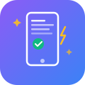
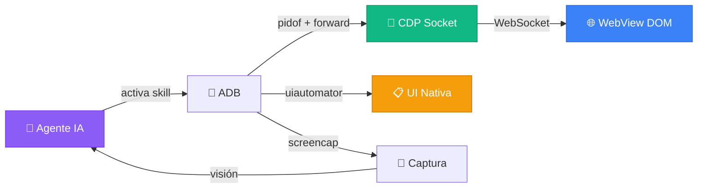

<p align="center">
  
</p>

<h1 align="center">Skill de Pruebas WebView Móvil</h1>

<p align="center">
  <strong>Deja que cualquier agente IA pruebe tu app en un teléfono Android real</strong><br>
  <sub>Chrome DevTools Protocol + ADB. Sin Appium. Sin Selenium. Sin servidor Java.</sub>
</p>

<p align="center">
  <a href="LICENSE"></a>&nbsp;
  <a href="https://agentskills.io/specification"></a>&nbsp;
  <a href="#compatibilidad"></a>&nbsp;
  <a href="https://github.com/wimi321/mobile-webview-testing/stargazers"></a>
</p>

<p align="center">
  <a href="README.md">English</a> · <a href="README.zh-CN.md">简体中文</a> · <a href="README.ja.md">日本語</a> · <a href="README.ko.md">한국어</a> · <strong>Español</strong> · <a href="README.ar.md">العربية</a>
</p>

---

> [!TIP]
> **Instala en 10 segundos** — compatible con Claude Code, Codex, Gemini CLI, Copilot, Cursor y más:
> ```
> npx skills add wimi321/mobile-webview-testing
> ```

<br>

## Por qué existe este Skill

Construiste una app con Capacitor o Ionic. Funciona perfecto en el navegador. Ahora necesitas probarla en un teléfono real.

Esto es lo que descubres:

| Herramienta | Problema |
|-------------|----------|
| `uiautomator` | **No puede ver el contenido del WebView.** Toda la UI de tu app es invisible para la automatización nativa — obtienes 3 nodos XML en lugar de 300. |
| Appium | **Servidor Java de 500MB.** Problemas constantes con el cambio de contexto WebView. Más de 30 minutos de configuración. |
| Cypress / Playwright | **No funcionan en dispositivos reales.** Las pruebas en emulador pasan, pero fallan en el teléfono real. GPU, memoria y comportamiento diferentes. |
| React DevTools | **Sin acceso CLI.** No se puede automatizar, no se puede usar con scripts, los agentes IA no lo pueden utilizar. |

**Este Skill resuelve los cuatro problemas.** Enseña a cualquier agente IA a probar tu app WebView usando Chrome DevTools Protocol — el mismo protocolo que Chrome usa internamente. Sin dependencias más allá de `adb` y Python.

<br>

## Qué hace

<table>
<tr>
<td width="50%" valign="top">

**Automatización WebView**
- Conecta a cualquier WebView via CDP
- Ejecuta JavaScript, consulta DOM, hace clic en elementos
- Navegación entre pantallas
- Espera a que carguen los elementos

</td>
<td width="50%" valign="top">

**Acceso al estado del framework**
- React: `__reactProps` + `onChange`
- Vue 2/3: `__vue__` + `dispatchEvent`
- Angular: `ng.getComponent` + zone
- Svelte: `dispatchEvent` nativo

</td>
</tr>
<tr>
<td width="50%" valign="top">

**Manejo de UI nativa**
- Diálogos de permisos via `uiautomator`
- Selectores de archivos, hojas de compartir
- Notificaciones del sistema
- Híbrido: CDP para web, uiautomator para nativo

</td>
<td width="50%" valign="top">

**Control del dispositivo**
- Capturas de pantalla con verificación AI
- Control de WiFi/datos para pruebas offline
- Filtrado de logcat y captura de consola
- Push de archivos grandes al almacenamiento

</td>
</tr>
</table>

<br>

## Inicio rápido

**Requisitos previos:** Teléfono Android con depuración USB + `adb` en PATH + Python 3 (`pip3 install websockets`)

### Paso 1 — Instalar el Skill

```bash
npx skills add wimi321/mobile-webview-testing
```

### Paso 2 — Conectar el teléfono

```bash
adb devices   # Verifica que tu dispositivo aparezca
```

### Paso 3 — Pedir al agente IA que pruebe

El agente activa automáticamente este Skill al mencionar pruebas móviles:

```
"Prueba el flujo de login en mi teléfono Android conectado"
"Verifica que la app funcione offline en el dispositivo real"
"Comprueba si el diseño RTL árabe se renderiza correctamente en móvil"
```

<br>

## Cómo funciona



<br>

## 8 Lecciones clave

> Lecciones duramente aprendidas probando apps en producción. Detalles completos en [COMMON-PITFALLS.md](mobile-webview-testing/references/COMMON-PITFALLS.md).

| # | Trampa | Solución |
|---|--------|----------|
| 1 | `uiautomator` no ve nada del WebView | Usa CDP — es la única forma de acceder al DOM |
| 2 | `input.value = 'x'` no actualiza React | Usa `__reactProps` y llama a `onChange()` directamente |
| 3 | Segundo CDP eval lanza `SyntaxError` | Envuelve todo el JS en IIFE — CDP comparte scope global |
| 4 | CDP muere tras `force-stop` | Nuevo PID = nuevo socket, reconexión completa necesaria |
| 5 | El tap da en el elemento equivocado | Usa selectores CSS (CDP) o bounds de `uiautomator dump` |
| 6 | Broadcast `AIRPLANE_MODE` denegado | Usa `svc wifi disable` + `svc data disable` |
| 7 | La app no puede leer archivos pushed | Usa pipe con `run-as` — almacenamiento con scope bloquea `/sdcard/` |
| 8 | Estado Vue/Angular no se actualiza | `dispatchEvent(new Event('input'))` funciona (a diferencia de React) |

<br>

## Compatibilidad

Este Skill sigue el [estándar abierto Agent Skills](https://agentskills.io/specification) y funciona con cualquier agente IA compatible:

<table>
<tr>
<td><strong>Completamente probado</strong></td>
<td>Claude Code</td>
</tr>
<tr>
<td><strong>Compatible</strong></td>
<td>Codex CLI · Gemini CLI · GitHub Copilot · Cursor · Cline · Windsurf · OpenCode · Aider · Continue y más</td>
</tr>
</table>

<br>

## vs Otros enfoques

|  | Este Skill | Appium | Maestro | Cypress | Manual |
|---|:-:|:-:|:-:|:-:|:-:|
| Dispositivo real | **Sí** | Sí | Sí | No | Sí |
| WebView DOM | **CDP** | Cambio contexto | CDP | N/A | Visual |
| Estado React | **`__reactProps`** | No | No | Sí | No |
| Nativo + Web | **Sí** | Sí | Sí | No | Sí |
| Tamaño instalación | **~0 MB** | ~500 MB | ~200 MB | ~300 MB | 0 MB |
| Tiempo config. | **30 seg** | 30+ min | 10 min | 5 min | — |
| Con IA | **Sí** | No | No | No | No |

<br>

## Nacido en producción

Este Skill se extrajo de las pruebas reales de [Beacon](https://github.com/wimi321/Beacon) — una app de respuesta a emergencias offline-first que ejecuta Gemma 4 on-device. Cada trampa, cada solución, cada fragmento de código fue descubierto probando una app Capacitor de producción en un teléfono Android físico.

No es teoría. Es experiencia de combate.

<br>

## Contribuir

¡Contribuciones bienvenidas! Áreas prioritarias:

- **Soporte iOS** — El protocolo Safari Web Inspector difiere de CDP
- **Más frameworks** — Ember, Preact, Solid, Lit
- **Nuevos scripts** — Perfilado de rendimiento, detección de memory leaks, auditoría de accesibilidad
- **Traducciones** — Ayuda a traducir a más idiomas

<br>

## Licencia

[MIT](LICENSE)
