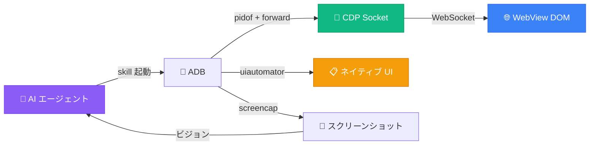

<p align="center">
  
</p>

<h1 align="center">モバイル WebView テスト Skill</h1>

<p align="center">
  <strong>あらゆる AI エージェントに実機でアプリをテストさせる</strong><br>
  <sub>Chrome DevTools Protocol + ADB。Appium・Selenium・Java サーバー不要</sub>
</p>

<p align="center">
  <a href="LICENSE"></a>&nbsp;
  <a href="https://agentskills.io/specification"></a>&nbsp;
  <a href="#互換性"></a>&nbsp;
  <a href="https://github.com/wimi321/mobile-webview-testing/stargazers"></a>
</p>

<p align="center">
  <a href="README.md">English</a> · <a href="README.zh-CN.md">简体中文</a> · <strong>日本語</strong> · <a href="README.ko.md">한국어</a> · <a href="README.es.md">Español</a> · <a href="README.ar.md">العربية</a>
</p>

---

> [!TIP]
> **10秒でインストール** — Claude Code、Codex、Gemini CLI、Copilot、Cursor などに対応：
> ```
> npx skills add wimi321/mobile-webview-testing
> ```

<br>

## なぜこの Skill が必要なのか

Capacitor や Ionic でアプリを構築した。ブラウザでは完璧に動く。でも実機でテストする必要がある。

すると、こうなる：

| ツール | 問題 |
|--------|------|
| `uiautomator` | **WebView のコンテンツが見えない。** アプリの UI 全体がネイティブ自動化ツールから不可視 — 300ノードではなく3ノードしか取得できない。 |
| Appium | **500MB の Java サーバー。** WebView コンテキスト切り替えで問題が頻発。セットアップに30分以上。 |
| Cypress / Playwright | **実機で実行できない。** エミュレータのテストは通るのに、実機では失敗する。GPU、メモリ、挙動すべてが異なる。 |
| React DevTools | **CLI アクセスがない。** 自動化不可、スクリプト化不可、AI エージェントには使えない。 |

**この Skill は4つすべてを解決する。** Chrome DevTools Protocol — Chrome が内部で使っているのと同じプロトコル — を使って、任意の AI エージェントに WebView アプリのテストを教える。依存関係は `adb` と Python のみ。

<br>

## 機能

<table>
<tr>
<td width="50%" valign="top">

**WebView 自動化**
- CDP で任意の WebView に接続
- JavaScript 実行、DOM クエリ、要素クリック
- 画面間ナビゲーション
- 要素の読み込み待機

</td>
<td width="50%" valign="top">

**フレームワーク状態アクセス**
- React: `__reactProps` + `onChange`
- Vue 2/3: `__vue__` + `dispatchEvent`
- Angular: `ng.getComponent` + zone
- Svelte: ネイティブ `dispatchEvent`

</td>
</tr>
<tr>
<td width="50%" valign="top">

**ネイティブ UI 操作**
- `uiautomator` でパーミッションダイアログ処理
- ファイルピッカー、共有シート
- システム通知
- ハイブリッド戦略：Web は CDP、ネイティブは uiautomator

</td>
<td width="50%" valign="top">

**デバイス制御**
- スクリーンショット + AI ビジョン検証
- WiFi/データ切替でオフラインテスト
- Logcat フィルタリングとコンソールキャプチャ
- 大容量ファイルのアプリストレージへの転送

</td>
</tr>
</table>

<br>

## クイックスタート

**前提条件：** USB デバッグ有効の Android 端末 + PATH に `adb` + Python 3（`pip3 install websockets`）

### ステップ 1 — Skill をインストール

```bash
npx skills add wimi321/mobile-webview-testing
```

### ステップ 2 — 端末を接続

```bash
adb devices   # デバイスがリストに表示されることを確認
```

### ステップ 3 — AI エージェントにテストさせる

モバイルテストに言及すると、エージェントが自動的にこの Skill を起動する：

```
「接続した Android 端末でログインフローをテストして」
「実機でオフラインモードが動作するか検証して」
「アラビア語 RTL レイアウトがモバイルで正しく表示されるか確認して」
```

<br>

## 仕組み



<br>

## 8つの重要な知見

> 本番アプリのテストから得た実戦的な教訓。詳細は [COMMON-PITFALLS.md](mobile-webview-testing/references/COMMON-PITFALLS.md) を参照。

| # | 落とし穴 | 解決策 |
|---|---------|--------|
| 1 | `uiautomator` は WebView 内が見えない | CDP を使う — DOM にアクセスする唯一の方法 |
| 2 | `input.value = 'x'` では React 状態が更新されない | `__reactProps` で `onChange()` を直接呼ぶ |
| 3 | 2回目の CDP eval で `SyntaxError` | すべての JS を IIFE でラップ — CDP はグローバルスコープを共有 |
| 4 | `force-stop` 後に CDP が切断 | 新しい PID = 新しいソケット、完全な再接続が必要 |
| 5 | タップが間違った要素に当たる | CSS セレクタ（CDP）か `uiautomator dump` の bounds を使う |
| 6 | `AIRPLANE_MODE` ブロードキャストが拒否される | `svc wifi disable` + `svc data disable` を使う |
| 7 | アプリが push したファイルを読めない | `run-as` パイプを使う — スコープドストレージが `/sdcard/` をブロック |
| 8 | Vue/Angular の状態が更新されない | `dispatchEvent(new Event('input'))` が有効（React とは異なる） |

<br>

## 互換性

この Skill は [Agent Skills オープン標準](https://agentskills.io/specification) に準拠し、準拠する任意の AI エージェントで動作する：

<table>
<tr>
<td><strong>完全テスト済み</strong></td>
<td>Claude Code</td>
</tr>
<tr>
<td><strong>互換</strong></td>
<td>Codex CLI · Gemini CLI · GitHub Copilot · Cursor · Cline · Windsurf · OpenCode · Aider · Continue など</td>
</tr>
</table>

<br>

## 他のアプローチとの比較

|  | この Skill | Appium | Maestro | Cypress | 手動 |
|---|:-:|:-:|:-:|:-:|:-:|
| 実機テスト | **対応** | 対応 | 対応 | 非対応 | 対応 |
| WebView DOM | **CDP** | コンテキスト切替 | CDP | N/A | 目視 |
| React 状態制御 | **`__reactProps`** | 非対応 | 非対応 | 対応 | 非対応 |
| ネイティブ + Web | **対応** | 対応 | 対応 | 非対応 | 対応 |
| インストールサイズ | **~0 MB** | ~500 MB | ~200 MB | ~300 MB | 0 MB |
| セットアップ時間 | **30秒** | 30分以上 | 10分 | 5分 | — |
| AI 駆動 | **対応** | 非対応 | 非対応 | 非対応 | 非対応 |

<br>

## 本番環境から生まれた

この Skill は [Beacon](https://github.com/wimi321/Beacon) の実テストから抽出された — LiteRT 経由で Gemma 4 をオンデバイス実行するオフラインファースト緊急対応アプリ。すべての落とし穴、回避策、コードスニペットは、物理 Android 端末で本番 Capacitor アプリをテストする中で発見されたもの。

理論ではない。実戦で検証済み。

<br>

## コントリビュート

コントリビュート歓迎！重点分野：

- **iOS サポート** — Safari Web Inspector プロトコルは CDP と異なる
- **追加フレームワーク** — Ember、Preact、Solid、Lit
- **新スクリプト** — パフォーマンス分析、メモリリーク検出、アクセシビリティ監査
- **翻訳** — より多くの言語への翻訳

<br>

## ライセンス

[MIT](LICENSE)
