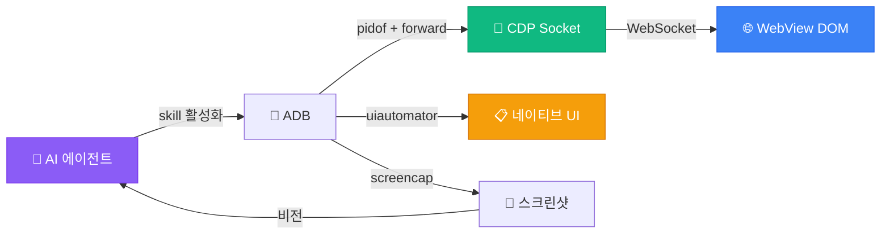

<p align="center">
  
</p>

<h1 align="center">모바일 WebView 테스트 Skill</h1>

<p align="center">
  <strong>모든 AI 에이전트가 실제 기기에서 앱을 테스트하게 하세요</strong><br>
  <sub>Chrome DevTools Protocol + ADB. Appium, Selenium, Java 서버 불필요</sub>
</p>

<p align="center">
  <a href="LICENSE"></a>&nbsp;
  <a href="https://agentskills.io/specification"></a>&nbsp;
  <a href="#호환성"></a>&nbsp;
  <a href="https://github.com/wimi321/mobile-webview-testing/stargazers"></a>
</p>

<p align="center">
  <a href="README.md">English</a> · <a href="README.zh-CN.md">简体中文</a> · <a href="README.ja.md">日本語</a> · <strong>한국어</strong> · <a href="README.es.md">Español</a> · <a href="README.ar.md">العربية</a>
</p>

---

> [!TIP]
> **10초 설치** — Claude Code, Codex, Gemini CLI, Copilot, Cursor 등과 호환:
> ```
> npx skills add wimi321/mobile-webview-testing
> ```

<br>

## 이 Skill이 필요한 이유

Capacitor나 Ionic으로 앱을 만들었다. 브라우저에서는 완벽하게 작동한다. 이제 실제 기기에서 테스트해야 한다.

그런데 이런 일이 벌어진다:

| 도구 | 문제 |
|------|------|
| `uiautomator` | **WebView 콘텐츠를 볼 수 없다.** 앱 UI 전체가 네이티브 자동화 도구에 보이지 않음 — 300개 노드 대신 3개만 나온다. |
| Appium | **500MB Java 서버.** WebView 컨텍스트 전환 문제가 빈번. 설정에 30분 이상 소요. |
| Cypress / Playwright | **실제 기기에서 실행 불가.** 에뮬레이터 테스트는 통과하지만 실기기에서 실패. GPU, 메모리, 동작이 모두 다르다. |
| React DevTools | **CLI 접근 불가.** 자동화 불가, 스크립팅 불가, AI 에이전트가 사용 불가. |

**이 Skill은 네 가지 문제를 모두 해결한다.** Chrome DevTools Protocol — Chrome이 내부적으로 사용하는 동일한 프로토콜 — 을 통해 모든 AI 에이전트가 WebView 앱을 테스트할 수 있도록 가르친다. `adb`와 Python만 있으면 된다.

<br>

## 기능

<table>
<tr>
<td width="50%" valign="top">

**WebView 자동화**
- CDP로 모든 WebView에 연결
- JavaScript 실행, DOM 쿼리, 요소 클릭
- 화면 간 내비게이션
- 요소 로딩 대기

</td>
<td width="50%" valign="top">

**프레임워크 상태 접근**
- React: `__reactProps` + `onChange`
- Vue 2/3: `__vue__` + `dispatchEvent`
- Angular: `ng.getComponent` + zone
- Svelte: 네이티브 `dispatchEvent`

</td>
</tr>
<tr>
<td width="50%" valign="top">

**네이티브 UI 처리**
- `uiautomator`로 권한 다이얼로그 처리
- 파일 피커, 공유 시트
- 시스템 알림
- 하이브리드: 웹은 CDP, 네이티브는 uiautomator

</td>
<td width="50%" valign="top">

**디바이스 제어**
- 스크린샷 + AI 비전 검증
- WiFi/데이터 토글로 오프라인 테스트
- Logcat 필터링 및 콘솔 캡처
- 대용량 파일을 앱 스토리지에 푸시

</td>
</tr>
</table>

<br>

## 빠른 시작

**사전 요구사항:** USB 디버깅이 활성화된 Android 기기 + PATH에 `adb` + Python 3 (`pip3 install websockets`)

### 1단계 — Skill 설치

```bash
npx skills add wimi321/mobile-webview-testing
```

### 2단계 — 기기 연결

```bash
adb devices   # 디바이스가 목록에 나타나는지 확인
```

### 3단계 — AI 에이전트에게 테스트 지시

모바일 테스트를 언급하면 에이전트가 자동으로 이 Skill을 활성화한다:

```
"연결된 Android 기기에서 로그인 플로우를 테스트해줘"
"실기기에서 오프라인 모드가 작동하는지 확인해줘"
"아랍어 RTL 레이아웃이 모바일에서 올바르게 렌더링되는지 확인해줘"
```

<br>

## 동작 원리



<br>

## 8가지 핵심 인사이트

> 프로덕션 앱 테스트에서 얻은 실전 교훈. 상세 내용은 [COMMON-PITFALLS.md](mobile-webview-testing/references/COMMON-PITFALLS.md) 참조.

| # | 함정 | 해결책 |
|---|------|--------|
| 1 | `uiautomator`가 WebView 내부를 못 봄 | CDP 사용 — DOM에 접근하는 유일한 방법 |
| 2 | `input.value = 'x'`로 React 상태 미갱신 | `__reactProps`로 `onChange()` 직접 호출 |
| 3 | 두 번째 CDP eval에서 `SyntaxError` | 모든 JS를 IIFE로 감싸기 — CDP는 전역 스코프 공유 |
| 4 | `force-stop` 후 CDP 연결 끊김 | 새 PID = 새 소켓, 전체 재연결 필요 |
| 5 | 탭이 잘못된 요소에 적중 | CSS 셀렉터(CDP)나 `uiautomator dump` bounds 사용 |
| 6 | `AIRPLANE_MODE` 브로드캐스트 거부 | `svc wifi disable` + `svc data disable` 사용 |
| 7 | 앱이 push한 파일을 못 읽음 | `run-as` 파이프 사용 — 범위 지정 저장소가 `/sdcard/` 차단 |
| 8 | Vue/Angular 상태 미갱신 | `dispatchEvent(new Event('input'))` 유효 (React와 다름) |

<br>

## 호환성

이 Skill은 [Agent Skills 오픈 표준](https://agentskills.io/specification)을 따르며, 호환 AI 에이전트에서 동작:

<table>
<tr>
<td><strong>완전 테스트</strong></td>
<td>Claude Code</td>
</tr>
<tr>
<td><strong>호환</strong></td>
<td>Codex CLI · Gemini CLI · GitHub Copilot · Cursor · Cline · Windsurf · OpenCode · Aider · Continue 등</td>
</tr>
</table>

<br>

## 다른 접근법과 비교

|  | 이 Skill | Appium | Maestro | Cypress | 수동 |
|---|:-:|:-:|:-:|:-:|:-:|
| 실기기 테스트 | **지원** | 지원 | 지원 | 미지원 | 지원 |
| WebView DOM | **CDP** | 컨텍스트 전환 | CDP | N/A | 육안 |
| React 상태 제어 | **`__reactProps`** | 미지원 | 미지원 | 지원 | 미지원 |
| 네이티브 + 웹 | **지원** | 지원 | 지원 | 미지원 | 지원 |
| 설치 크기 | **~0 MB** | ~500 MB | ~200 MB | ~300 MB | 0 MB |
| 설정 시간 | **30초** | 30분 이상 | 10분 | 5분 | — |
| AI 구동 | **지원** | 미지원 | 미지원 | 미지원 | 미지원 |

<br>

## 프로덕션에서 탄생

이 Skill은 [Beacon](https://github.com/wimi321/Beacon)의 실제 테스트에서 추출됨 — LiteRT를 통해 Gemma 4를 온디바이스로 실행하는 오프라인 우선 긴급 대응 앱. 모든 함정, 우회 방법, 코드 스니펫은 물리적 Android 기기에서 프로덕션 Capacitor 앱을 테스트하면서 발견한 것.

이론이 아닌 실전.

<br>

## 기여

기여 환영! 중점 분야:

- **iOS 지원** — Safari Web Inspector 프로토콜은 CDP와 다름
- **추가 프레임워크** — Ember, Preact, Solid, Lit
- **새 스크립트** — 성능 분석, 메모리 누수 탐지, 접근성 감사
- **번역** — 더 많은 언어로 번역

<br>

## 라이선스

[MIT](LICENSE)
