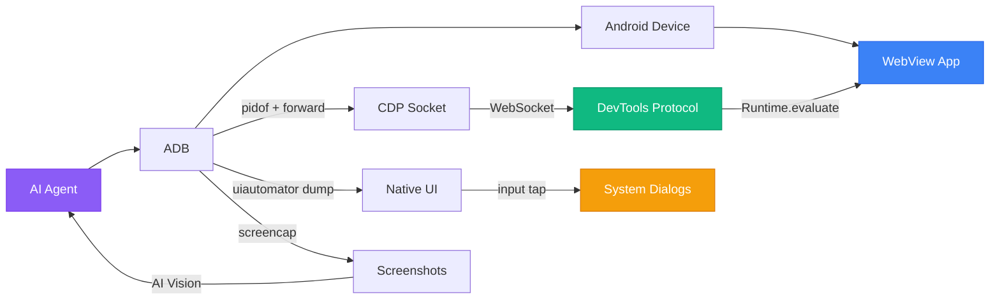

<p align="center">
  <h1 align="center">mobile-webview-testing</h1>
  <p align="center">
    <strong>The agent skill for testing Capacitor & WebView apps on real Android devices</strong><br>
    CDP + ADB, no Appium required — works with 18+ AI agents
  </p>
</p>

<p align="center">
  <a href="LICENSE"></a>
  <a href="https://agentskills.io/specification"></a>
  <a href="#compatibility"></a>
</p>

---

> [!TIP]
> **Install in 10 seconds:**
> ```bash
> npx skills add wimi321/mobile-webview-testing
> ```
> Works with Claude Code, Codex, Gemini CLI, Copilot, Cursor, Cline, and more.

## The Problem

Testing Capacitor and WebView hybrid apps on real devices is broken:

- **`uiautomator` can't see WebView content** — your entire app UI is invisible to native Android automation. You get 3 nodes instead of 300.
- **Appium requires a 500MB Java server** and fights with WebView context switching. Setup takes 30+ minutes.
- **Cypress and Playwright don't run on real devices** — your emulator tests pass, your real phone fails. Different GPU, different memory, different behavior.
- **React state is inaccessible** — even if you reach the DOM, `input.value = 'x'` does nothing because React ignores direct property changes.

This skill solves all four problems. It teaches any AI agent to test your WebView app on a real Android phone using **Chrome DevTools Protocol** — the same protocol Chrome uses internally. No server. No Java. Just `adb` and a USB cable.

## What This Skill Does

- **Connects to any WebView** via CDP — discovers the DevTools socket, forwards the port, establishes a WebSocket connection
- **Executes JavaScript** inside the WebView — queries DOM, clicks buttons, reads text, navigates between screens
- **Manipulates React state** — uses React's internal `__reactProps` to trigger `onChange`, the only reliable way to interact with controlled inputs
- **Handles native dialogs** — permission prompts, file pickers, and system dialogs via `uiautomator` (the hybrid approach)
- **Takes and verifies screenshots** — captures the screen via `adb screencap` and uses AI vision to verify the UI
- **Tests offline mode** — controls WiFi and mobile data via ADB to verify your app works without network
- **Debugs with logcat + CDP** — filters device logs and captures WebView console output

## Quick Start

### Prerequisites

- Android device connected via USB with **USB debugging enabled**
- `adb` available in PATH
- Python 3 with `websockets` (`pip3 install websockets`)

### 1. Install the skill

```bash
npx skills add wimi321/mobile-webview-testing
```

### 2. Connect your phone

Plug in your Android device via USB and verify:

```bash
adb devices  # Should list your device
```

### 3. Let your AI agent test

Open your AI coding assistant and describe what you want to test. The agent will automatically activate this skill and:

1. Connect to your app's WebView via CDP
2. Interact with your UI through JavaScript evaluation
3. Handle permission dialogs via native automation
4. Take screenshots to verify each step
5. Report results with visual evidence

**Example prompts:**
- "Test the login flow on my connected Android phone"
- "Verify the app works in offline mode on the real device"
- "Check if the form submission works on mobile"
- "Test the Arabic RTL layout on my phone"

## How It Works



**Key insight:** WebView content requires CDP. Native dialogs require `uiautomator`. This skill uses both — a hybrid approach that covers 100% of the UI.

## Skill Contents

| File | Purpose |
|------|---------|
| [`SKILL.md`](mobile-webview-testing/SKILL.md) | Core instructions — 8-phase testing methodology |
| [`scripts/cdp-connect.sh`](mobile-webview-testing/scripts/cdp-connect.sh) | One-command CDP connection |
| [`scripts/cdp-eval.py`](mobile-webview-testing/scripts/cdp-eval.py) | Python CDP evaluator with IIFE wrapping |
| [`scripts/react-interact.js`](mobile-webview-testing/scripts/react-interact.js) | React state manipulation snippets |
| [`scripts/native-ui-parser.py`](mobile-webview-testing/scripts/native-ui-parser.py) | Parse and tap native UI elements |
| [`references/COMMON-PITFALLS.md`](mobile-webview-testing/references/COMMON-PITFALLS.md) | 8 battle-tested pitfalls and solutions |
| [`references/REACT-STATE.md`](mobile-webview-testing/references/REACT-STATE.md) | Deep React state manipulation guide |
| [`references/FRAMEWORK-SUPPORT.md`](mobile-webview-testing/references/FRAMEWORK-SUPPORT.md) | Vue, Angular, Svelte support |
| [`references/TEST-CHECKLIST.md`](mobile-webview-testing/references/TEST-CHECKLIST.md) | 12-point test template |

## Compatibility

This skill follows the [Agent Skills open standard](https://agentskills.io/specification) and works with:

| Agent | Status |
|-------|--------|
| Claude Code | Fully tested |
| Codex CLI (OpenAI) | Compatible |
| Gemini CLI (Google) | Compatible |
| GitHub Copilot | Compatible (VS Code) |
| Cursor | Compatible |
| Cline | Compatible |
| Windsurf | Compatible |
| OpenCode | Compatible |
| And 10+ more... | [Full list](https://agentskills.io) |

## Key Insights

These are hard-won lessons from testing real production apps. Each is explained in detail in [COMMON-PITFALLS.md](mobile-webview-testing/references/COMMON-PITFALLS.md):

1. **WebView is invisible to uiautomator** — CDP is the only way to reach your app's DOM
2. **React ignores `.value = x`** — you must use `__reactProps` and call `onChange()` directly
3. **CDP shares global scope** — always wrap JavaScript in IIFE to avoid `SyntaxError`
4. **App restart breaks CDP** — the WebSocket URL changes with the new PID, full reconnection required
5. **Coordinates are unreliable** — use CSS selectors (CDP) or `uiautomator dump` bounds, never guess
6. **Airplane mode is privileged** — use `svc wifi disable` + `svc data disable` instead
7. **Scoped storage blocks file access** — use `run-as` pipe to reach app internal storage
8. **Vue/Angular use native events** — `dispatchEvent(new Event('input'))` works, unlike React

## vs Other Approaches

| | This Skill | Appium | Maestro | Cypress | Manual |
|---|:-:|:-:|:-:|:-:|:-:|
| **Real device** | Yes | Yes | Yes | No | Yes |
| **WebView content** | CDP | Context switch | CDP | N/A | Eyes |
| **React state** | `__reactProps` | No | No | Yes | No |
| **Native + Web** | Hybrid | Yes | Yes | No | Yes |
| **Install size** | ~0 MB | ~500 MB | ~200 MB | ~300 MB | 0 MB |
| **Setup time** | 30 sec | 30+ min | 10 min | 5 min | — |
| **AI-powered** | Yes | No | No | No | No |
| **Framework-aware** | React/Vue/Angular/Svelte | No | No | React only | No |

## Born from Production

This skill was extracted from real-world testing of [Beacon](https://github.com/wimi321/Beacon), an offline-first emergency response app running Gemma 4 on-device via LiteRT. Every pitfall, every workaround, every code snippet was discovered by testing a production Capacitor app on a physical Android phone.

## Contributing

Contributions welcome! Areas where help is needed:

- **iOS support** — Safari Web Inspector protocol is different from CDP
- **More framework patterns** — Ember, Preact, Solid, etc.
- **Additional scripts** — performance profiling, memory leak detection
- **Translations** — SKILL.md in other languages

## License

[MIT](LICENSE) — use it anywhere, no restrictions.
