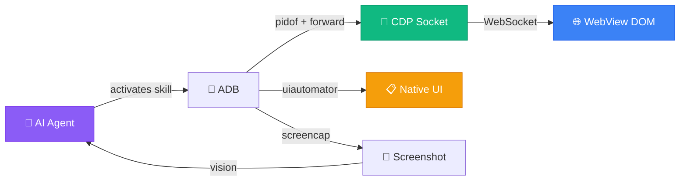

<p align="center">
  
</p>

<h1 align="center">Mobile WebView Testing Skill</h1>

<p align="center">
  <strong>Teach any AI agent to test your app on a real Android phone</strong><br>
  <sub>Chrome DevTools Protocol + ADB. No Appium. No Selenium. No Java server.</sub>
</p>

<p align="center">
  <a href="LICENSE"></a>&nbsp;
  <a href="https://agentskills.io/specification"></a>&nbsp;
  <a href="#compatibility"></a>&nbsp;
  <a href="https://github.com/wimi321/mobile-webview-testing/stargazers"></a>
</p>

<p align="center">
  <a href="README.zh-CN.md">简体中文</a> · <a href="README.ja.md">日本語</a> · <a href="README.ko.md">한국어</a> · <a href="README.es.md">Español</a> · <a href="README.ar.md">العربية</a>
</p>

---

> [!TIP]
> **Install in 10 seconds** — works with Claude Code, Codex, Gemini CLI, Copilot, Cursor, and more:
> ```
> npx skills add wimi321/mobile-webview-testing
> ```

<br>

## Why This Skill Exists

You built a Capacitor or Ionic app. It works great in the browser. Now you need to test it on a real phone.

Here's what you discover:

| Tool | Problem |
|------|---------|
| `uiautomator` | **Can't see WebView content.** Your entire app UI is invisible — you get 3 XML nodes instead of 300. |
| Appium | **500MB Java server.** Fights with WebView context switching. 30+ minutes to set up. |
| Cypress / Playwright | **Can't run on real devices.** Emulator tests pass, real phone fails. Different GPU, different memory, different bugs. |
| React DevTools | **No CLI access.** Can't automate. Can't script. Can't let AI agents use it. |

**This skill solves all four.** It teaches any AI agent to test your WebView app through Chrome DevTools Protocol — the same protocol Chrome uses internally. Zero dependencies beyond `adb` and Python.

<br>

## What It Does

<table>
<tr>
<td width="50%" valign="top">

**WebView Automation**
- Connect to any WebView via CDP
- Execute JavaScript, query DOM, click elements
- Navigate between screens
- Wait for elements to load

</td>
<td width="50%" valign="top">

**Framework State Access**
- React: `__reactProps` + `onChange`
- Vue 2/3: `__vue__` + `dispatchEvent`
- Angular: `ng.getComponent` + zone
- Svelte: native `dispatchEvent`

</td>
</tr>
<tr>
<td width="50%" valign="top">

**Native UI Handling**
- Permission dialogs via `uiautomator`
- File pickers, share sheets
- System notifications
- Hybrid: CDP for web, uiautomator for native

</td>
<td width="50%" valign="top">

**Device Control**
- Screenshots with AI vision verification
- WiFi/data toggle for offline testing
- Logcat filtering and console capture
- Large file push to app storage

</td>
</tr>
</table>

<br>

## Quick Start

**Prerequisites:** Android phone with USB debugging + `adb` in PATH + Python 3 (`pip3 install websockets`)

### Step 1 — Install the skill

```bash
npx skills add wimi321/mobile-webview-testing
```

### Step 2 — Connect your phone

```bash
adb devices   # Verify your device appears
```

### Step 3 — Ask your AI agent to test

The agent automatically activates this skill when you mention mobile testing:

```
"Test the login flow on my connected Android phone"
"Verify the app works offline on the real device"
"Check if the Arabic RTL layout renders correctly on mobile"
```

The agent will connect via CDP, interact with your app, handle permission dialogs, take screenshots, and report results.

<br>

## How It Works



| Layer | What | How |
|-------|------|-----|
| **Web content** | Buttons, inputs, text, navigation | CDP `Runtime.evaluate` |
| **Framework state** | React controlled inputs, Vue data | `__reactProps` / `dispatchEvent` |
| **Native dialogs** | Permissions, file picker, share | `uiautomator` dump + `input tap` |
| **Device state** | Network, screen, logs | `adb shell svc` / `screencap` / `logcat` |

<br>

## Skill Contents

```
mobile-webview-testing/
├── SKILL.md                          # Core: 8-phase testing methodology
├── scripts/
│   ├── cdp-connect.sh                # One-command CDP connection
│   ├── cdp-eval.py                   # JS evaluator with IIFE wrapping
│   ├── react-interact.js             # React state manipulation snippets
│   └── native-ui-parser.py           # Parse & tap native UI elements
└── references/
    ├── COMMON-PITFALLS.md            # 8 battle-tested pitfalls
    ├── REACT-STATE.md                # Deep React state guide
    ├── FRAMEWORK-SUPPORT.md          # Vue, Angular, Svelte patterns
    └── TEST-CHECKLIST.md             # 12-point test template
```

<br>

## 8 Key Insights

> Hard-won lessons from testing production apps. Full details in [COMMON-PITFALLS.md](mobile-webview-testing/references/COMMON-PITFALLS.md).

| # | Pitfall | Solution |
|---|---------|----------|
| 1 | `uiautomator` sees nothing in WebView | Use CDP — it's the only way to reach the DOM |
| 2 | `input.value = 'x'` doesn't update React | Use `__reactProps` and call `onChange()` directly |
| 3 | Second CDP eval throws `SyntaxError` | Wrap all JS in IIFE — CDP shares global scope |
| 4 | CDP dies after `force-stop` | New PID = new socket — full reconnection required |
| 5 | Tap hits the wrong element | Use CSS selectors (CDP) or `uiautomator dump` bounds |
| 6 | `AIRPLANE_MODE` broadcast denied | Use `svc wifi disable` + `svc data disable` instead |
| 7 | App can't read pushed files | Use `run-as` pipe — scoped storage blocks `/sdcard/` |
| 8 | Vue/Angular state won't update | `dispatchEvent(new Event('input'))` works (unlike React) |

<br>

## Compatibility

This skill follows the [Agent Skills open standard](https://agentskills.io/specification) and works with any compliant AI agent:

<table>
<tr>
<td><strong>Fully Tested</strong></td>
<td>Claude Code</td>
</tr>
<tr>
<td><strong>Compatible</strong></td>
<td>Codex CLI · Gemini CLI · GitHub Copilot · Cursor · Cline · Windsurf · OpenCode · Aider · Continue · and more</td>
</tr>
</table>

> The Agent Skills format is an open standard — if your AI agent supports `SKILL.md`, this skill works with it.

<br>

## vs Other Approaches

|  | This Skill | Appium | Maestro | Cypress | Manual |
|---|:-:|:-:|:-:|:-:|:-:|
| Real device testing | **Yes** | Yes | Yes | No | Yes |
| WebView DOM access | **CDP** | Context switch | CDP | N/A | Eyes only |
| React state control | **`__reactProps`** | No | No | Yes | No |
| Native + Web hybrid | **Yes** | Yes | Yes | No | Yes |
| Install size | **~0 MB** | ~500 MB | ~200 MB | ~300 MB | 0 MB |
| Setup time | **30 sec** | 30+ min | 10 min | 5 min | — |
| AI agent powered | **Yes** | No | No | No | No |
| Framework-aware | **4 frameworks** | No | No | React only | No |

<br>

## Born from Production

This skill was extracted from real-world testing of [Beacon](https://github.com/wimi321/Beacon) — an offline-first emergency response app running Gemma 4 on-device. Every pitfall, every workaround, every code snippet was discovered testing a production Capacitor app on a physical Android phone.

Not theory. Battle-tested.

<br>

## Contributing

Contributions welcome! High-impact areas:

- **iOS support** — Safari Web Inspector protocol differs from CDP
- **More frameworks** — Ember, Preact, Solid, Lit
- **New scripts** — performance profiling, memory leak detection, accessibility audit
- **Translations** — help localize this skill for more developers

<br>

## License

[MIT](LICENSE)
