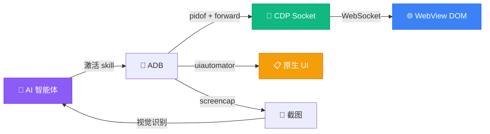

<p align="center">
  
</p>

<h1 align="center">移动端 WebView 测试 Skill</h1>

<p align="center">
  <strong>让任何 AI 智能体在真机上测试你的应用</strong><br>
  <sub>Chrome DevTools Protocol + ADB，无需 Appium、Selenium 或 Java 服务器</sub>
</p>

<p align="center">
  <a href="LICENSE"></a>&nbsp;
  <a href="https://agentskills.io/specification"></a>&nbsp;
  <a href="#兼容性"></a>&nbsp;
  <a href="https://github.com/wimi321/mobile-webview-testing/stargazers"></a>
</p>

<p align="center">
  <a href="README.md">English</a> · <strong>简体中文</strong> · <a href="README.ja.md">日本語</a> · <a href="README.ko.md">한국어</a> · <a href="README.es.md">Español</a> · <a href="README.ar.md">العربية</a>
</p>

---

> [!TIP]
> **10 秒安装** — 兼容 Claude Code、Codex、Gemini CLI、Copilot、Cursor 等：
> ```
> npx skills add wimi321/mobile-webview-testing
> ```

<br>

## 为什么需要这个 Skill

你用 Capacitor 或 Ionic 构建了一个应用。在浏览器里运行完美。现在你需要在真机上测试。

然后你发现：

| 工具 | 问题 |
|------|------|
| `uiautomator` | **看不到 WebView 内容。** 整个应用 UI 对原生自动化工具不可见 —— XML 只有 3 个节点而不是 300 个。 |
| Appium | **500MB Java 服务器。** WebView 上下文切换问题不断，安装配置需要 30+ 分钟。 |
| Cypress / Playwright | **无法在真机上运行。** 模拟器测试通过，真机上却失败。GPU、内存、行为全都不同。 |
| React DevTools | **没有 CLI 接口。** 无法自动化，无法脚本化，无法让 AI 智能体使用。 |

**这个 Skill 解决了全部四个问题。** 它教会任何 AI 智能体通过 Chrome DevTools Protocol 测试你的 WebView 应用 —— Chrome 内部使用的同一套协议。零额外依赖，只需要 `adb` 和 Python。

<br>

## 功能概览

<table>
<tr>
<td width="50%" valign="top">

**WebView 自动化**
- 通过 CDP 连接任意 WebView
- 执行 JavaScript、查询 DOM、点击元素
- 页面间导航
- 等待元素加载

</td>
<td width="50%" valign="top">

**框架状态访问**
- React: `__reactProps` + `onChange`
- Vue 2/3: `__vue__` + `dispatchEvent`
- Angular: `ng.getComponent` + zone
- Svelte: 原生 `dispatchEvent`

</td>
</tr>
<tr>
<td width="50%" valign="top">

**原生 UI 处理**
- 通过 `uiautomator` 处理权限对话框
- 文件选择器、分享菜单
- 系统通知
- 混合策略：CDP 管 Web，uiautomator 管原生

</td>
<td width="50%" valign="top">

**设备控制**
- 截图 + AI 视觉验证
- WiFi/数据开关用于离线测试
- Logcat 过滤和控制台捕获
- 大文件推送到应用存储

</td>
</tr>
</table>

<br>

## 快速开始

**前置条件：** 开启 USB 调试的 Android 手机 + PATH 中有 `adb` + Python 3（`pip3 install websockets`）

### 第 1 步 — 安装 Skill

```bash
npx skills add wimi321/mobile-webview-testing
```

### 第 2 步 — 连接手机

```bash
adb devices   # 确认设备出现在列表中
```

### 第 3 步 — 让 AI 智能体测试

当你提到移动端测试时，智能体会自动激活此 Skill：

```
"在我连接的 Android 手机上测试登录流程"
"验证应用在真机上的离线模式是否正常"
"检查阿拉伯语 RTL 布局在手机上是否正确渲染"
```

智能体会连接 CDP、操作应用、处理权限对话框、截图验证并汇报结果。

<br>

## 工作原理



| 层 | 内容 | 方式 |
|----|------|------|
| **Web 内容** | 按钮、输入框、文本、导航 | CDP `Runtime.evaluate` |
| **框架状态** | React 受控输入、Vue 数据 | `__reactProps` / `dispatchEvent` |
| **原生对话框** | 权限、文件选择器、分享 | `uiautomator` dump + `input tap` |
| **设备状态** | 网络、屏幕、日志 | `adb shell svc` / `screencap` / `logcat` |

<br>

## Skill 内容

```
mobile-webview-testing/
├── SKILL.md                          # 核心：8 阶段测试方法论
├── scripts/
│   ├── cdp-connect.sh                # 一键 CDP 连接
│   ├── cdp-eval.py                   # JS 执行器（自动 IIFE 包装）
│   ├── react-interact.js             # React 状态操控代码片段
│   └── native-ui-parser.py           # 原生 UI 元素解析与点击
└── references/
    ├── COMMON-PITFALLS.md            # 8 个实战踩坑及解决方案
    ├── REACT-STATE.md                # React 状态深度指南
    ├── FRAMEWORK-SUPPORT.md          # Vue、Angular、Svelte 模式
    └── TEST-CHECKLIST.md             # 12 项测试模板
```

<br>

## 8 个核心经验

> 真实生产环境测试中得到的实战经验。完整详情见 [COMMON-PITFALLS.md](mobile-webview-testing/references/COMMON-PITFALLS.md)。

| # | 踩坑 | 解决方案 |
|---|------|---------|
| 1 | `uiautomator` 看不到 WebView 内容 | 用 CDP —— 这是访问 DOM 的唯一途径 |
| 2 | `input.value = 'x'` 无法更新 React 状态 | 用 `__reactProps` 直接调用 `onChange()` |
| 3 | 第二次 CDP eval 抛出 `SyntaxError` | 用 IIFE 包装所有 JS —— CDP 共享全局作用域 |
| 4 | `force-stop` 后 CDP 断连 | 新 PID = 新 socket，需要完整重连 |
| 5 | 点击命中错误元素 | 用 CSS 选择器（CDP）或 `uiautomator dump` 获取精确坐标 |
| 6 | `AIRPLANE_MODE` 广播被拒绝 | 改用 `svc wifi disable` + `svc data disable` |
| 7 | 应用无法读取推送的文件 | 用 `run-as` 管道 —— 分区存储阻止了 `/sdcard/` 访问 |
| 8 | Vue/Angular 状态不更新 | `dispatchEvent(new Event('input'))` 有效（与 React 不同） |

<br>

## 兼容性

此 Skill 遵循 [Agent Skills 开放标准](https://agentskills.io/specification)，兼容任何符合规范的 AI 智能体：

<table>
<tr>
<td><strong>完整测试</strong></td>
<td>Claude Code</td>
</tr>
<tr>
<td><strong>兼容</strong></td>
<td>Codex CLI · Gemini CLI · GitHub Copilot · Cursor · Cline · Windsurf · OpenCode · Aider · Continue 等</td>
</tr>
</table>

<br>

## 对比其他方案

|  | 此 Skill | Appium | Maestro | Cypress | 手动 |
|---|:-:|:-:|:-:|:-:|:-:|
| 真机测试 | **支持** | 支持 | 支持 | 不支持 | 支持 |
| WebView DOM 访问 | **CDP** | 上下文切换 | CDP | 不适用 | 肉眼 |
| React 状态控制 | **`__reactProps`** | 不支持 | 不支持 | 支持 | 不支持 |
| 原生 + Web 混合 | **支持** | 支持 | 支持 | 不支持 | 支持 |
| 安装体积 | **~0 MB** | ~500 MB | ~200 MB | ~300 MB | 0 MB |
| 配置时间 | **30 秒** | 30+ 分钟 | 10 分钟 | 5 分钟 | — |
| AI 驱动 | **支持** | 不支持 | 不支持 | 不支持 | 不支持 |
| 框架感知 | **4 种框架** | 不支持 | 不支持 | 仅 React | 不支持 |

<br>

## 源于生产实践

此 Skill 提炼自 [Beacon](https://github.com/wimi321/Beacon) 的真实测试实践 —— 一个通过 LiteRT 在设备端运行 Gemma 4 的离线优先紧急响应应用。每一个踩坑、每一个解决方案、每一段代码片段，都来自在物理 Android 手机上测试生产级 Capacitor 应用的真实经验。

不是理论，是实战。

<br>

## 参与贡献

欢迎贡献！重点方向：

- **iOS 支持** — Safari Web Inspector 协议与 CDP 不同
- **更多框架** — Ember、Preact、Solid、Lit
- **新脚本** — 性能分析、内存泄漏检测、无障碍审计
- **翻译** — 帮助翻译更多语言版本

<br>

## 许可证

[MIT](LICENSE)
